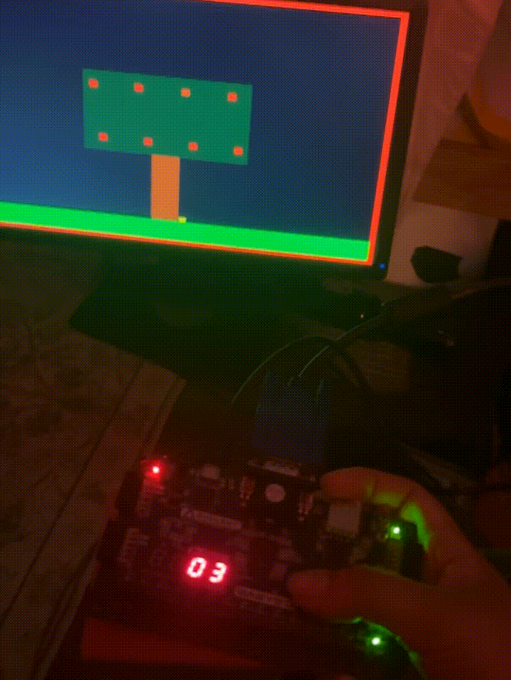

────────────────────────────────────
          Verilog VGA Arcade

      Basys 3 FPGA • Verilog • VGA
────────────────────────────────────

A real-time arcade game implemented in Verilog for the Digilent Basys 3 FPGA.

This project demonstrates FPGA-based game development using finite state machines, VGA graphics, pseudo-random number generation, collision detection, and real-time rendering.

---

## Demo

<p align="center">
  
</p>

---

## Features

- VGA graphics at 640×480 resolution
- Finite State Machine (FSM) game control
- Real-time player movement
- Collision detection
- Random apple spawning using an LFSR
- Seven-segment display score output
- LED life counter
- Golden Apple bonus mechanic
- Apple wiggle animation
- Game-over state handling

---

## Hardware

- Digilent Basys 3 FPGA
- Xilinx Vivado
- VGA Monitor

---

## Technologies

- Verilog HDL
- FPGA Design
- Digital Logic
- Finite State Machines
- LFSR
- VGA Video Generation

---

## Project Structure

```
src/
    Top.v
    VGA_Sync.v
    Apple.v
    Player.v
    LFSR.v
    ...

constraints/
    Basys3.xdc

images/
    gameplay.gif
    block_diagram.png
```

---

## System Architecture

<p align="center">
  
</p>

The game consists of several independent hardware modules:

- VGA synchronization
- Pixel renderer
- Player controller
- Apple controller
- LFSR random number generator
- Collision detection
- Score and life tracking
- Seven-segment display driver

Each module communicates through the top-level controller while remaining independently testable.

---

## Gameplay

1. Press **Center Button** to start the game.
2. Move the player using the left and right buttons.
3. Catch falling apples to increase your score.
4. Catch Golden Apples to gain an extra life.
5. Avoid missing apples.
6. The game ends after all lives are lost.

---

## What I Learned

This project strengthened my understanding of:

- FPGA architecture
- Verilog HDL
- Synchronous digital design
- VGA timing
- Finite State Machine design
- Collision detection
- Hardware debugging
- Modular hardware design

---

## Future Improvements

- Multiple difficulty levels
- Sound effects
- Sprite-based graphics
- Additional enemy types
- High score memory
- PS/2 keyboard support

---

## Author

**Aneel Bhatia**

Computer Engineering Student

University of California, Santa Cruz
